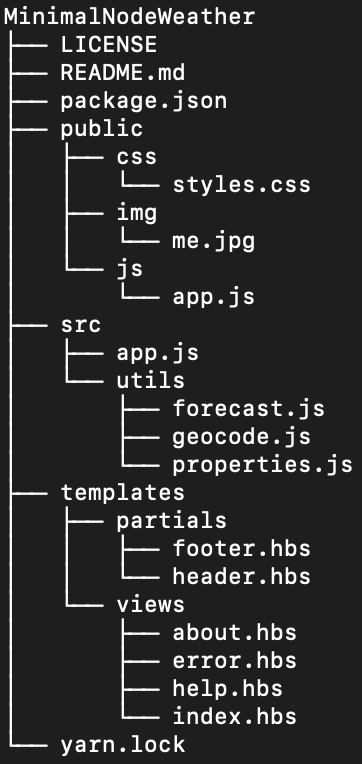

# MinimalNodeWeather

A simple, minimalistic weather app made with NodeJs. 

This repo is open for PRs. 

## :computer: How to run the project

1. Install [NodeJS](https://nodejs.org/en/download/). 
1. Install [yarn](https://www.npmjs.com/package/yarn).
1. Install [nodemon](https://www.npmjs.com/package/nodemon).
1. Type ```yarn install``` to install all node modules.
1. Type ```nodemon -e js,hbs``` in the root of the project to start the server.
1. Open ```localhost:3000```.

## :file_folder: Project Structure

<p align="center"></p>

The client side files can be found in the ```public``` folder. This node project uses [handlebars](https://www.npmjs.com/package/handlebars) for views.
